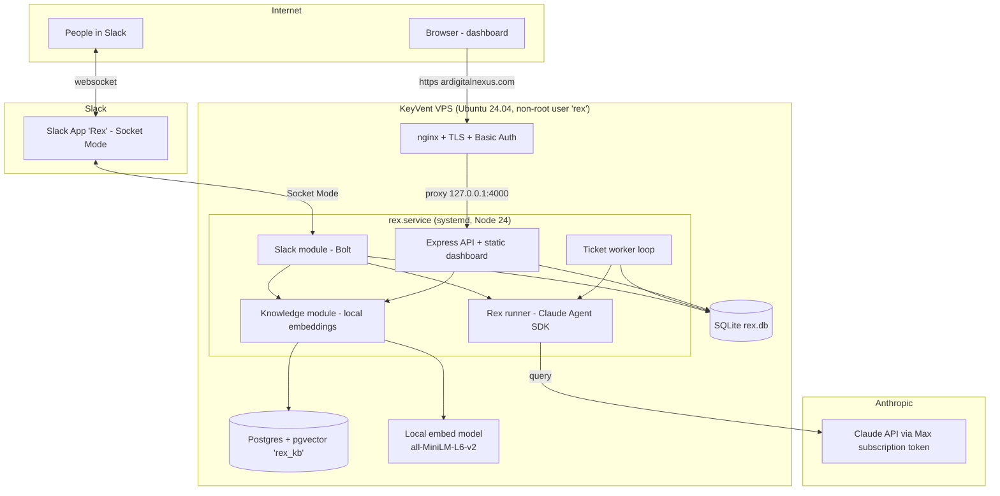
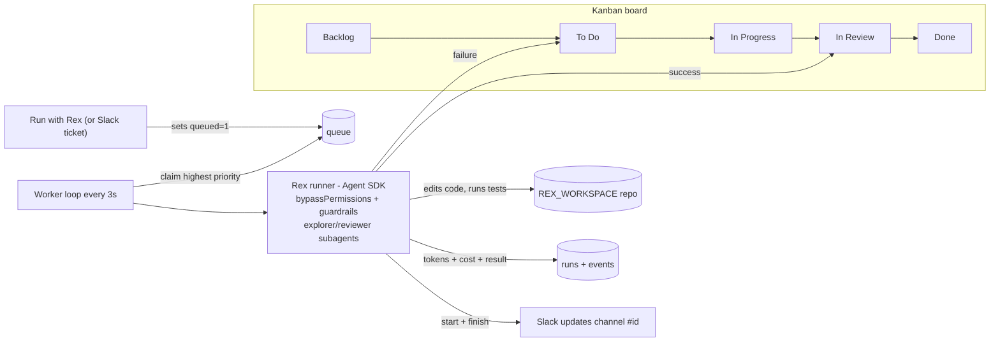
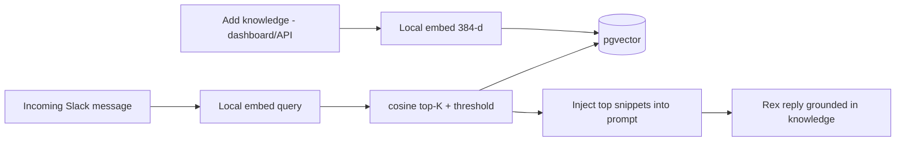

# Rex — Architecture & Documentation

Rex is an autonomous AI engineer/operator. People talk to him in **Slack**; work is tracked on a
**Jira-style board**; he executes coding tickets with the **Claude Agent SDK**; and he remembers
facts via a **pgvector knowledge base**. Everything runs as **one Node.js service** on a single VPS.

---

## 1. System topology



**Key facts**
- **One process** (`rex.service`) runs three concurrent jobs: the Slack bot, the ticket worker, and the web/API server. They share the SQLite DB in-process.
- Runs as the **non-root `rex` user** (Claude Code refuses autonomous mode as root; also limits blast radius).
- **Node 24** at `/opt/node24` (isolated from the box's system Node 18).
- **Auth to Claude** = a Max-subscription OAuth token (`CLAUDE_CODE_OAUTH_TOKEN`) — no per-token API billing.
- Dashboard is **localhost-bound**; the public surface is nginx (TLS + HTTP Basic Auth) on `ardigitalnexus.com`.

---

## 2. Data stores

| Store | Holds | Why |
|---|---|---|
| **SQLite** (`/opt/rex/rex.db`) | tickets, runs, events, settings, people (team profiles), scripts, script_runs | App data — single-writer, zero-setup, fast |
| **Postgres + pgvector** (`rex_kb`) | `knowledge` (content + `vector(384)` + HNSW cosine index) | Semantic search needs a vector DB |
| **Local model cache** (`/home/rex`) | `all-MiniLM-L6-v2` ONNX weights | Embeddings run on-box, free, no API key |

```mermaid
erDiagram
  tickets ||--o{ runs : has
  tickets ||--o{ events : has
  runs ||--o{ events : emits
  tickets { int id; text title; text status; text priority; text type; text assignee; int queued }
  runs { int id; int input_tokens; int output_tokens; real cost_usd; int num_turns; text result_summary }
  events { int id; text type; text content }
  people { int id; text name; text title; text role; text slack_user_id }
  scripts ||--o{ script_runs : has
  knowledge { int id; text content; vector embedding; text source }
```

---

## 3. Slack message pipeline

Every `@Rex` mention or DM runs through one decision pipeline. Cheap/deterministic checks come
first; the model is only called when needed.

```mermaid
flowchart TD
  A[Slack event: app_mention or DM] --> D{Duplicate?<br/>seen channel:ts}
  D -- yes --> X[drop]
  D -- no --> S[strip @mention]
  S --> E{Contains ' :: '?}
  E -- yes --> T1[File ticket directly] --> END1[queue for worker]
  E -- no --> ADM{Admin request?<br/>verb + channel/member}
  ADM -- yes --> ADMRUN["parseAdminIntent (model)<br/>+ workspace-admin gate"] --> ADMDO[create/archive/invite/kick] --> END2[reply result]
  ADM -- no --> REL{@-mentions another person?}
  REL -- yes --> RELDO[Relay message to them] --> END3[post heads-up]
  REL -- no --> CTX[gather context:<br/>thread history + team roster + KB recall]
  CTX --> TRI["triage (model): TASK / CHAT"]
  TRI -- TASK --> T2[File ticket] --> END4[queue + reply]
  TRI -- CHAT --> CH[Reply in Rex's persona] --> END5[post reply]
```

**Context Rex assembles before replying (the system prompt):**
- **Persona** (editable in Settings) — his voice + conversation rules.
- **Team roster** — from team profiles + live Slack channel members (name + job title).
- **Thread history** — last ~20 messages of the current thread (so he follows the conversation).
- **KB recall** — top-K relevant knowledge entries (semantic search; see §5).

All untrusted text (thread + chat) is sanitised and placed in the user turn, never the system prompt, to block prompt injection. Reference data (roster) is sanitised per-field.

---

## 4. Ticket execution flow (the board)



- Tickets are worked **one at a time**, highest **priority** first.
- Rex runs with `permissionMode: bypassPermissions` but **guardrails block** `git push`, `rm -rf`, `git reset --hard`; capped at `REX_MAX_TURNS`.
- On success → **In Review** (a human signs off). On failure → back to **To Do**.
- Per-run **tokens + cost** are recorded and shown on the board + the live activity log.

---

## 5. Knowledge base (RAG) flow



- **Embeddings run locally** (all-MiniLM-L6-v2) — search costs **zero Claude tokens**.
- Recall is **selective**: only the top-K (4) entries above a similarity threshold are injected — so the prompt stays small no matter how big the KB grows.

---

## 6. Capabilities

| Area | What Rex can do |
|---|---|
| **Chat (Slack)** | Natural, human conversation; adapts tone to the person's role (exec/business/technical); says "I don't know" plainly when out of context; knows the team from Slack profiles |
| **Tickets** | File from Slack or dashboard; Jira board (Backlog→Done); priority/type/assignee; run autonomously; result lands in In Review |
| **Code work** | Clone/read/edit a repo, run commands & tests, self-verify, summarise the change (runs as non-root, guardrailed) |
| **Relay** | "tell/remind @person …" → posts a tagged heads-up |
| **Slack admin** (workspace-admins only) | Create/archive channels, add/remove members, resolve "all developers" by Slack title |
| **Shell scripts** | Saved script library, run on-box (60s timeout, output capped, audited) |
| **Knowledge** | Long-term memory with semantic recall, grounded answers |
| **Config** | Editable persona, work standards, team profiles, Slack updates channel |
| **Observability** | Per-ticket + total token burn and cost on the dashboard |

---

## 7. Security model

- **Public surface** = nginx only (TLS + HTTP Basic Auth). Rex binds `127.0.0.1`.
- **Non-root execution** — `rex` user; cannot touch `/var/www/keyvent` or run privileged ops.
- **Slack admin actions gated** to workspace admins/owners (checked via `users.info`).
- **Prompt-injection defenses** — untrusted chat → user turn, sanitised; roster/KB fields sanitised; output markers defanged.
- **Event de-dup** — prevents double replies / double ticket execution.
- **Secrets** in `/opt/rex/.env` (chmod 600). Code is in a **private** repo; no secrets committed.

---

## 8. Token / cost model

Rex is on a **Max subscription** (usage, not per-call dollars), so the goal is staying within usage limits.

| Path | Model calls | Notes |
|---|---|---|
| Slack chat | 1 triage call (Sonnet) per message | + ~600 input tokens when KB/roster inject |
| Slack admin | 1 intent call (Sonnet) | only when verb+context present |
| **Ticket run** | **many turns (Opus)** | **the dominant cost** — real engineering work |
| KB search | **0 Claude tokens** | local embeddings + Postgres |

The expensive part is **Opus ticket runs**, not chat. Optimisations target avoiding redundant calls
and keeping prompts lean (see CHANGELOG / token-reduction notes).

---

## 9. Deploy & ops

- **Repo:** `github.com/Atifnaquee09/Rex` (private, branch `main`).
- **Deploy:** `git pull` → `npm install` (if deps changed) → `systemctl restart rex`.
- **Logs:** `journalctl -u rex -f`. **Status:** `systemctl status rex`.
- **Config:** `/opt/rex/.env` (auth token, Slack tokens, `DATABASE_URL`, workspace, model, port/host).
- **Backups worth taking:** `rex.db` (app data) and the `rex_kb` Postgres DB (knowledge).
```
